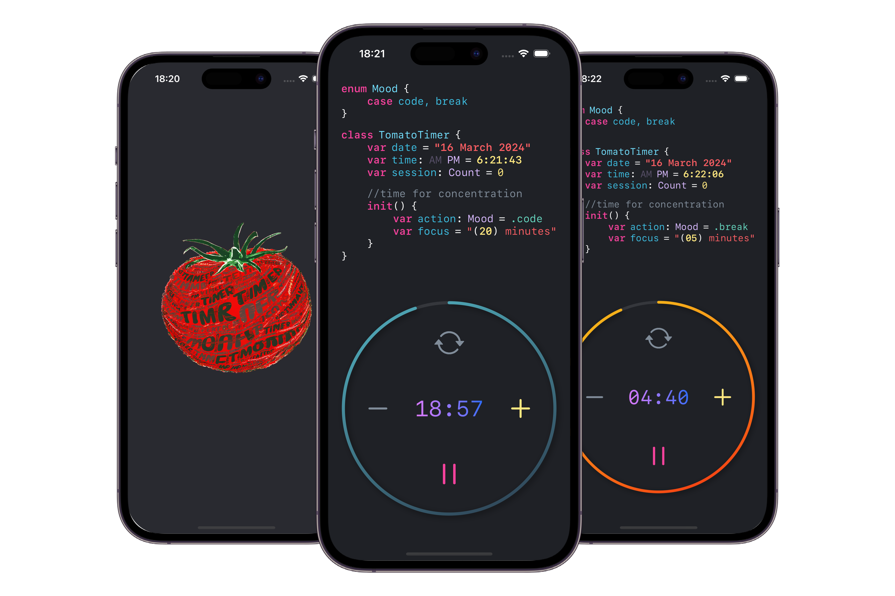

# MyAppsSwift

### All my applications that I created myself.

| Apps                          | Screenshots                                        |        
| ------------------------------| :---------------:                                  |
| Answer Book    <a href="https://apps.apple.com/app/tomato-time-app/id6479194735">App Store</a>               | |  
| Tomato Timer   <a href="https://apps.apple.com/app/answer-book/id6478613851">App Store</a>                   | |  
| TerraScape     <a href="https://apps.apple.com/us/app/terrascape/id6670364178">App Store</a>                 | |                               
| Pulse Ride(in progress)                                                                                      |  |                            
| MindGrid (in progress)                                                                                       |  |
